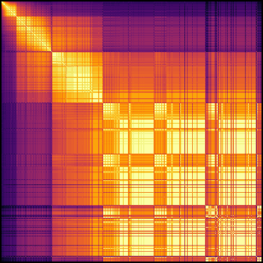

# number-vectors

A small program to plot the semantic similarities of numbers using GloVe.
Numbers are well-ordered, so this produces a cohesive 2D plot, unlike other word vector visualizations.

This reveals some interesting things about the model and dataset.
For example, based on which number ranges co-occur, people tend to think in terms of these "size categories":

 - 1 - 10
 - 11 - 31
 - 32 - 100
 - 100 - 200
 - 200 - 500

## Model

This project uses [Stanford NLP's GloVe vectors](https://nlp.stanford.edu/projects/glove/) through spaCy,
trained on Common Crawl 2014.

## Usage

`poetry run numbers.py --help`
